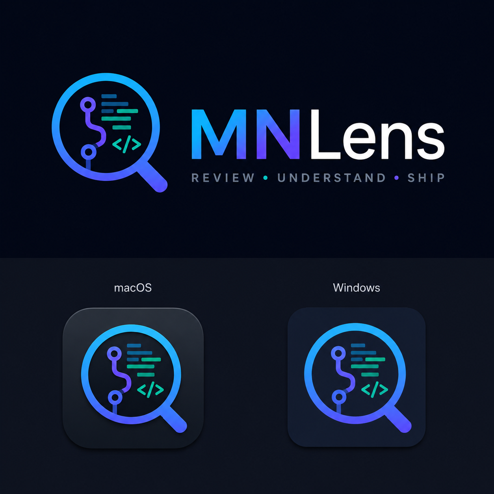

<p align="center">
  
</p>

# MNLens

**MNLens is a local-first GitHub pull request review workstation.** It brings queue triage, linked issues, CI status, review comments, risk analysis, test planning, research, Codex-assisted fixes, local verification, artifacts, and final handoff into one human-controlled review flow.

MNLens is not a hosted bot. It runs on your machine, uses your local `gh`, `git`, and Codex setup, stores data locally, and keeps review submission, commits, rebases, and pushes behind explicit human approval.

> [!IMPORTANT]
> This project was vibe coded. Treat it like an early beta: inspect the code, validate workflows on your machine, and keep human review in the loop before trusting generated analysis or code changes.

## Why It Exists

Code review work is usually scattered across GitHub tabs, CI logs, local terminals, notes, and AI chats. MNLens turns a PR into a structured review session:

- What changed?
- What matters most in source code, tests, docs, and CI?
- Which comments are unresolved?
- Which checks can be automated instead of left as reviewer memory?
- Can Codex prepare a focused patch without pushing it?
- What should the human reviewer approve, request, or hand off?

## Features

- **Review queue:** assigned PRs, review-requested PRs, optionally your own PRs.
- **Fast Analyze visible:** lightweight scoring for queue triage without running a deep Codex review for every PR.
- **Deep Analyze:** richer Codex-backed review guidance with evidence, risks, test quality, research, and final comment draft.
- **Review tabs:** Overview, Plan, Diff, Commits, Research, Codex, Comment, and Handoff.
- **Reviewer Focus:** unresolved GitHub line comments are promoted into actionable review items with Codex actions.
- **Code-aware diff viewer:** file review state, overview pins, inline comment drafting, and `Cmd/Ctrl+F` find inside code views.
- **CI interpretation:** failing checks can be explained or addressed through Codex.
- **Tests To Check:** prefers runnable/local verification and doc-render artifacts over manual checklists.
- **Codex sessions:** run, retry, continue, guide, cancel, inspect logs, and review prepared code changes before push.
- **Artifacts:** generated screenshots, rendered docs, logs, and review bundles.
- **GitHub Projects:** attach a PR, and optionally linked issues, to organization/user Projects V2 when token permissions allow it.
- **Local data controls:** export review bundles or clear local cache/worktrees/artifacts.
- **Desktop app:** Electron wrapper that starts the local server and opens MNLens in a native window.

## Requirements

Required:

- Node.js 20+
- Git
- GitHub CLI (`gh`)
- Codex CLI
- OS secure credential store:
  - macOS Keychain
  - Windows Credential Manager
  - Linux Secret Service/libsecret

Recommended for verification workflows:

- Java/JDK
- Gradle or project Gradle wrappers
- Maven or project Maven wrappers
- Browser tooling used by project-specific docs/screenshots

The first-run setup screen checks required tools and displays install hints.

## GitHub Token Permissions

Prefer a fine-grained PAT limited to the repositories and organizations you review.

For read/review workflows:

- Metadata: read
- Contents: read
- Pull requests: read
- Issues: read
- Actions: read
- Checks: read
- Commit statuses: read
- Projects: read, if you want to list GitHub Projects

For write workflows:

- Pull requests: write, to submit reviews
- Issues: write, to reply in conversations where GitHub treats PRs as issues
- Projects: write, to attach PRs and linked issues to GitHub Projects
- Contents: write, only if you want MNLens to push approved fixes or rebases

Classic PAT fallback:

- `public_repo` can be enough for public repositories.
- `repo` is needed for private repositories or broad classic-token access.

## Local Development

Install dependencies:

```sh
npm install
```

Run the local server:

```sh
npm run dev
```

Open:

```text
http://localhost:4321
```

Useful validation commands:

```sh
npm run typecheck
npm test
npm run test:e2e
npm run build
```

## Desktop Builds

Run the desktop app in development mode:

```sh
npm run desktop:dev
```

Build unpacked desktop output:

```sh
npm run desktop:build
```

Build release packages:

```sh
npm run dist:mac
npm run dist:win
npm run dist:linux
```

The macOS DMG is produced under `release/`.

## macOS Signing And Notarization

Local builds currently use Electron Builder's ad-hoc macOS signing fallback. That is enough for personal testing, but not enough for a polished public macOS release.

Without paid Apple Developer credentials, you can:

- Build a local DMG.
- Run the app locally after approving macOS security prompts if needed.
- Share unsigned beta builds with clear install instructions.

Before broader external distribution, add:

- Developer ID signing
- Apple notarization
- Auto-update with signed update artifacts

## Local Data

MNLens stores local state under `.pra-cache` in development and under the app user-data directory in packaged Electron builds. This can include:

- PR snapshots
- analysis results
- review progress
- Codex logs and worktrees
- verification logs
- rendered docs/screenshots/artifacts
- exported review bundles

Use **Export data** to create a review bundle. Use **Clear local data** to delete local cache, artifacts, worktrees, and review state.

## Beta Limitations

- The app is designed for local use and binds to localhost by default.
- Running jobs are recovered as interrupted/resumable after restart; external processes may need to be rerun.
- MNLens depends on locally installed CLIs and project toolchains.
- Codex-generated changes are only prepared for human review; pushing requires explicit approval.
- GitHub API rate limits matter. The UI displays remaining quota and backs off when limited, but heavy usage can still exhaust quota.
- The desktop app is not notarized yet.

## Security Model

- GitHub tokens are stored in the OS credential store when possible.
- The local server requires an MNLens session token for API requests.
- MNLens should not be exposed on a public network.
- Generated code changes, rebases, reviews, and pushes must be inspected by a human before approval.

## License

Apache License 2.0. See [LICENSE](LICENSE).
